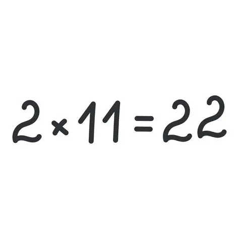

# Proyecto Demo de Markdown 
Bienvenidos a este **increible** tutorial

Aqui aprenderemos a usar *cursiva* y **negritas**

## Seccion 1: Introduccion
### Pasos a seguir
1. Instalar Git
2.  Configurar usuario

### Lista de compras
- [x] Comprar cafe
- [x] Aprender Markdown
- [ ] Aprobar examen

### Ejemplo de codigo
Para imprimir en Python usamos: `print()`
```pyhton
def saludo ():
print ("Hola Clase")
```

Fixes https://github.com/carlososwgucr/mi-repo-git/issues/13 

| Tarea           | Estado        | Responsable     |
|-----------------|--------------|-----------------|
| Crear API       | En progreso   | Carlos          |
| Diseñar UI      | Pendiente     | Ana             |
| Pruebas         | Completado    | Luis            |


